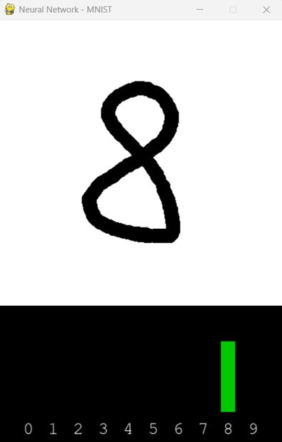
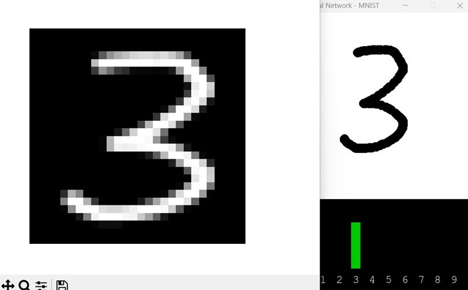

# Neural Network with MNIST Database

## Overview

I was working through Coursera's 'Deep Learning Specialization' (https://www.coursera.org/specializations/deep-learning), and was just wrapping up the 'Improving Deep Neural Networks' course when I paused to put some of my learnings to use.

I wanted to train against the MNIST database (https://en.wikipedia.org/wiki/MNIST_database), and create a neural network application that could train against that using various parameters, and also demonstrate its applicability through a user interface using a given trained model.

The implementation assumes a simple-ish Feedforward Neural Network (FNN), and supports fully-connected layers with varying training features.

## Supported Training Features

- Hidden layer dimensions
- Weight initialization type (Random, XavierUniform, XavierNormal, HeUniform, HeNormal)
- Bias initialization type (Zero, Constant, Random)
- Hidden layer activation type (ReLU, Linear, Sigmoid, LeakyReLU, ELU, TanH)
- Learning rate with optional decay types (time-based or exponential)
- Optimization types (GD, Momentum, RMSProp, Adam)
- Number of Epochs
- Dropout Rate
- Mini-Batches
- Early stopping with optional delta
- Specified percentages for validation and testing sets

## Installation

It's Python, so, pretty straight-forward. 

Download/clone the repo, and run:
```pip install -r requirements.txt```

You'll need to extract ```mnist_784.csv``` from ```mnist_784.zip``` in order to perform any training.

The program assumes (without any parameters) that training data will come from mnist_784.csv.

If you want to create smaller subsets to train/model against, there's a command for that (see below).

## Usage Notes

In most cases safe and reasonable defaults are assumed for all parameters. If you miss something, the program will scream at you :).

The program allows for:
- Creating datasets from larger/source files (```--create_dataset```)
- Model training (```--train```)
- Viewing models (```--read_model```)
- And runnin a UI to test a model (no parameters)

I've included a ```model-001.pkl``` file. It turned out pretty good all things considered. I know FNN aren't the best for these types of problems, and I do plan to redo some of this once I get around to playing with CNNs.

Before I implemented image augmentation (stretch, rotation, shifting) my results were OK, but not great. After image augmentation was put in place, the models turned out much better.

One of the best training runs I had was from this command:

```.\main.py --train --data_file mnist_784.csv --epochs 5000 --optimizer 'adam' --hidden_dimensions [128] --dropout_rate 20 --batch_size 1000 --early_stopping --early_stopping_patience 10 --show_charts --validation_size 20 --image_aug_stretch 20 --image_aug_rotate 40 --image_aug_shift 8```

## Creating Datasets

Create a subset of number data from a given source file. For example, the mnist_784.csv file contains 70,000 samples. You might want to create a smaller subset to play with:

```main.py --create_dataset --samples 1000 --save_file subset.csv```

## Training Models

Train a _very basic_ model:

```main.py --train --data_file subset.csv```

Will use some very basic defaults to run through some training.

__Note__: By default the model will be saved to model.pkl (can change the file with ```--model_file```)

Show the cost & accuracy charts (```--show_charts```):

```main.py --train --data_file subset.csv --show_charts```

__Note__: Accuracy will only show if a validation set was specified.

Train with a Validation and Testing subset (specified in %):

```main.py --train --data_file subset.csv --validation_size 10 --testing_size 5```

Change the hidden layer structure (e.g. two hidden layers with 12 nodes each):

```main.py --train --data_file subset.csv --hidden_dimensions [12,12]```

Use Momentum optimization (```--optimizer 'momentum'```):

```main.py --train --data_file subset.csv --optimizer 'momentum' --momentum_beta 0.9```

Use RMSProp optimization (```--optimizer 'rmsprop'```):

```main.py --train --data_file subset.csv --optimizer 'rmsprop' --rmsprop_beta 0.9```

Use Adam optimization (```--optimizer 'adam'```):

```main.py --train --data_file subset.csv --optimizer 'adam' --adam_beta1 0.9 --adam_beta2 0.999```

Specify a Dropout rate (```--dropout_rate```):

```main.py --train --data_file subset.csv --dropout_rate 20```

Specify sizes for mini-batches (```--batch_size```):

```main.py --train --data_file subset.csv --batch_size 100```

Implement early stopping (```--early_stopping```):

```main.py --train --data_file subset.csv --validation_size 10 --early_stopping --early_stopping_patience 10 --early_stopping_delta 1e-06```

Implement learning decay (```--decay_type```):

```main.py --train --data_file subset.csv --decay_type 'time' --decay_param 0.01```

Training with image augmentation (```--image_aug_*```):

```main.py --train --data_file subset.csv --image_aug_stretch 10```

```main.py --train --data_file subset.csv --image_aug_rotate 20```

```main.py --train --data_file subset.csv --image_aug_shift 6```

__Note__: Image augmentation will drastically slow down training, however, it gave me the best overall models.

## Reading Model Files

Read an existing model file (```--read_model```):

```main.py --read_model --model_file model.pkl```

This will show the parameters used to train the network.

Show charts from an existing model file:

```main.py --read_model --model_file model.pkl --show_charts```

## Other

Show a test image from a dataset (```--show_image```):

```main.py --data_file subset.csv --show_image --index 7```

Change how often stats are shown (```--stat_frequency```):

```main.py --data_file subset.csv --stat_frequency 10```

## User Interface

The UI uses pygame to create/manage the interface.

Run the UI (will assume model.plk as the model):

```main.py```

Run the UI without a model (for testing/debugging):

```main.py --no_model```

Run the UI with a specific model:

```main.py --model_file mymodel.pkl```

## User Interface Notes

You can draw in the white space, and the probability/guess (as determined by the model) of the number drawn will be shown at the bottom.

</a>

Right-click to clear the drawing surface.

Press the 's' key to __show__ the image that is currently being interpreted.

</a>